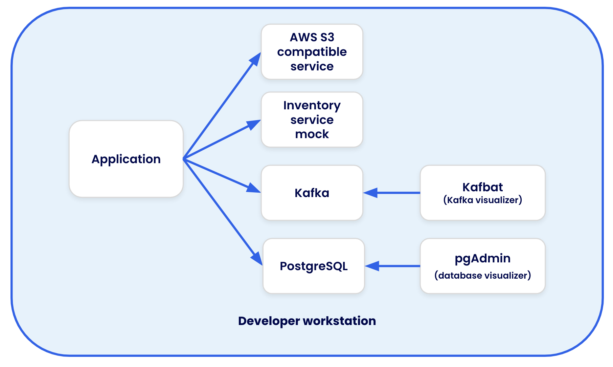

# Catalog Service - Node

This repo is a demo project that demonstrates all of Docker's services in a single project. Specifically, it includes the following:

- A containerized development environment (in a few varieties of setup)
- Integration testing with Testcontainers
- Building in GitHub Actions with Docker Build Cloud

This project is also setup to be used for various demos. Learn more about the demo setups by using [the README in the ./demo directory](./demo/README.md).

## Application architecture

This sample app provides an API that utilizes the following setup:

- Data is stored in a PostgreSQL database
- Product images are stored in a AWS S3 bucket
- Inventory data comes from an external inventory service
- Updates to products are published to a Kafka cluster

During development, containers provide the following services:

- PostgreSQL and Kafka runs directly in a container
- LocalStack is used to run S3 locally
- WireMock is used to mock the external inventory service
- pgAdmin and kafbat are added to visualize the PostgreSQL database and Kafka cluster

